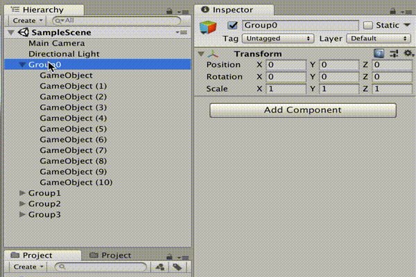
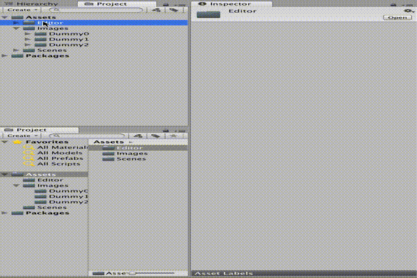

# Select History

History management tool for object selection of Project View and Hierarchy View. You can easily access the object you selected a while ago.

## DEMO
Hierarchy view demo

Project View Demo

## Feature
* Record the selected object (max 30 history)
* [shift + command + h] Back history
* [shift + command + l] Next history

see SelectHistory.cs

## Usage
import SelectHistory.unitypackage
## Licence

[MIT](https://github.com/tcnksm/tool/blob/master/LICENCE)

## Author

[Syy9](https://github.com/Syy9)
